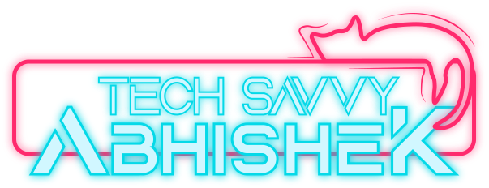

            
        

        

            
        

        

            
            
            
        

        

            
        

        <h1>Hello there! 
              I'm Abhishek
        </h1>
        

            An aspiring engineer who loves to build digital solutions that can make a difference in the world.
        

        <h2>~  About Me  ~
        </h2>
        

            
            - 🚀 I'm on a mission to <b>build amazing web and mobile apps</b> that leverage the latest and greatest
            technologies and
            frameworks.
               
            - 🎓 I'm constantly learning <b>how to optimize my web apps for security, performance, and user
                experience</b>.
               
            - 🙌 I'm open to collaborate on <b>any creative and meaningful projects that can push me out of my comfort
                zone and help
                me grow as a developer</b>.
               
            - 🙏 I'm seeking help with <b>diving into new areas and technologies, and polishing my existing skills</b>.
               
            - 💬 Feel free to ask me about <b>anything related to web development, mobile development, or graphic
                design</b>.
               
            - 📧 You can reach me by <b>sending an email to abhishekgs999@outlook.com or connecting with me on
                LinkedIn</b>.
               
            - 😄 My pronouns are <b>he/him</b>
               
            - 🏫 I'm also an engineering student at <b>NITK, majoring in Information technology</b>.
              
            - ⚡ A fun fact about me is <b>I love graphic design as a hobby, where I create stunning visuals that convey
                powerful messages</b>
              
            - 🎨 My other hobbies are <b>video editing, playing video games and drawing</b>.
        

        <h2>~  Skills 
            ~</h2>
        <h3>Programming Languages</h3>
        
        
        
        
        
        
        
                
        <h3>Frontend development</h3>
        
        
        
                
        
        
             
        
                
        <h3>Backend development</h3>
        
        
        
        
        
                        
        <h3>Mobile App development</h3>
        
        
        <h3>Database</h3>
        
        
        
        <h3>Softwares</h3>
        
                
        
        
        
        
        
        
        <h3>Others</h3>
        
        
                
        <h2>~  Achievements  ~</h2>
        
 
        

        

        <h2>~  Featured Projects  ~
        </h2>
        

            
            
            
        

            
        

        

          
        

            
        

        <h2 align="center">  Thanks for Reading! 
        </h2>
